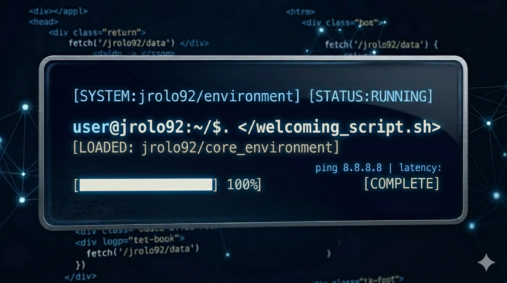

# ¡Hola! Soy Javi 👋

  

### 🚀 Sobre mí
- 💻 Actualmente estudiante de Desarrollo de Aplicaciones Web**
- 🌱 Aprendiendo profundamente sobre **PHP | JavaScript | HTML | CSS**
- 🏃‍♂️ Apasionado del **Trail Running** y la naturaleza.

---

### 🛠 Mi Stack Tecnológico

  
  
  
  
  
  

---

### 📊 Mis Estadísticas de GitHub

  

  

  

---

### 🤝 Conectemos

---
*Este perfil se actualiza automáticamente con mis últimas aventuras en el código.*
